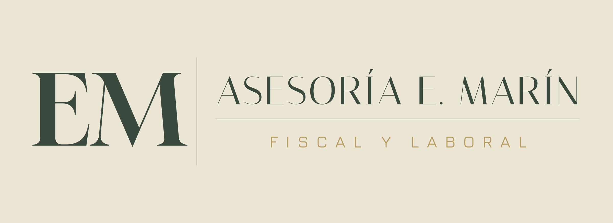

# Avisos Asesoría E. Marín

Herramienta de escritorio para generar los **avisos a clientes** (solicitud de
documentación, recordatorios de plazos, cierre de ejercicio, Renta…) siempre con
la **misma estética** de la asesoría y exportarlos a **PDF** para guardar y enviar.

El objetivo es tener un único estilo, coherente con el manual de marca (logo,
colores y pie de página fijos), y poder cambiar solo los datos de cada aviso:
periodo, año, fecha límite, nombre del cliente y la lista de documentos.



## Características

- Plantillas predefinidas con la redacción real de la oficina:
  - **Solicitud de documentación — Trimestre**
  - **Recordatorio de plazos — Cierre de trimestre**
  - **4.º Trimestre + Resumen Anual (cierre de ejercicio)** (con felicitación navideña opcional)
  - **Renta — Bienes arrendados**
- Periodo y **año se sugieren solos** según la fecha del sistema, y la **fecha límite**
  se calcula con la regla real de la AEAT: día 20 (o siguiente día hábil si cae en fin de
  semana o festivo nacional/Viernes Santo), y la fecha de **domiciliación** (ese día menos
  5 naturales), que es la que se usa por defecto en los avisos.
- Lista de documentos editable y notas adicionales.
- **Editor del documento tipo Word**: el texto predefinido se carga ya resuelto (con
  cliente, periodo y fecha) y se puede **editar libremente** — añadir líneas y espacios,
  cambiar palabras, poner negrita/cursiva, viñetas… Si no se ha tocado a mano, al cambiar
  los datos del formulario el texto se reescribe solo (la fecha sigue siendo automática);
  si se ha editado, no se pisa (avisa y deja reescribir a demanda). Botón «Restaurar texto
  de la plantilla».
- **«Guardar como predeterminado»**: convierte el texto que tengas en el editor en el
  texto base de ese tipo de aviso, para todos los futuros (p. ej. todos los trimestres).
  Al guardarlo se reinsertan automáticamente los comodines de cliente, periodo y fecha, de
  modo que esos datos se siguen rellenando solos; las listas y la tabla de plazos también
  se conservan como comodines. Se puede revisar/deshacer en Editar plantillas.
- **Documentación opcional reutilizable**: bloques de documentos con nombre (p. ej. «Venta
  de bienes inmuebles»), con una frase introductoria opcional y su propia lista, que se
  añaden o quitan con un clic en cualquier tipo de aviso. Se insertan como su propio
  párrafo y su propia lista (no se mezclan con la lista de documentos base). Se gestionan
  desde Herramientas → Documentación opcional.
- **Vista previa del PDF** en una pestaña, idéntica al PDF final, con aviso si el texto no
  cabe en una sola página o si la fecha límite cae en fin de semana/festivo.
- Cabecera con el logo, colores de marca y pie de página fijo en todos los avisos.
- **Base de datos de clientes** (nombre, NIF, teléfono, email) con autocompletado en el
  campo «Cliente» y relleno automático del NIF en el aviso. Los clientes nuevos se
  añaden solos al generar un aviso a su nombre.
- **Generar para varios clientes**: el mismo aviso (misma plantilla y mismos datos),
  una copia en PDF individual por cada cliente elegido.
- **Historial** de avisos generados, con búsqueda por cliente y acceso directo al PDF.
- **Editor de plantillas** para cambiar los textos desde la propia aplicación, sin tocar código.
- **Formato del documento** (Herramientas → Formato del documento…): fuente, tamaño de letra,
  interlineado y espacio entre párrafos configurables al estilo Word, con vista previa en
  vivo. Se guarda y se aplica a todos los avisos futuros.
- **Generar y guardar PDF** guarda automáticamente en el Escritorio con el nombre del
  cliente y el tipo de aviso (sin diálogo de guardado).
- **Comprobación de actualizaciones** contra los releases de GitHub (automática al abrir,
  o desde Ayuda → Buscar actualizaciones): descarga e instala la versión nueva con un clic.
  La consulta se hace en segundo plano (no congela la interfaz aunque la red vaya lenta).
- **Robustez**: registro de actividad y errores en `%APPDATA%\AvisosEMarin\avisos.log`
  (los fallos inesperados muestran un aviso claro en vez de cerrar la app en silencio),
  y escritura atómica de todos los datos (un corte de luz no corrompe clientes/plantillas).
- La ventana **recuerda su tamaño y la posición del separador** entre sesiones, y
  Herramientas → Abrir carpeta de datos da acceso directo a los archivos para copias
  de seguridad.

## Cálculo de plazos (AEAT)

En `avisos/templates.py` (`fecha_general_periodo`, `fecha_domiciliacion_periodo`) se calcula
la fecha límite general de cada trimestre (día 20 para 1T/2T/3T; **día 30 para el 4T**, porque
coincide con los resúmenes anuales), retrasándola al siguiente día hábil si cae en sábado,
domingo, festivo nacional fijo o Viernes Santo (calculado por fórmula, no festivos
autonómicos/locales). La fecha de domiciliación son **3 días hábiles antes** de esa fecha
ajustada (no un "-5 naturales" fijo: coincide con -5 cuando de por medio hay fin de semana,
pero da -3 si no lo hay, como pasa en enero). Verificado contra el calendario oficial de la
AEAT para 2026 (4T 2025: general 30/01/2026, domiciliación 27/01/2026).
**Importante:** solo cubre festivos nacionales — conviene revisar el calendario oficial de la
AEAT en fechas señaladas o con festivos locales de Murcia, que la propia AEAT sí tiene en
cuenta para estos cálculos.

## Estética / manual de estilo

Todo lo que define el estilo está centralizado en [`avisos/config.py`](avisos/config.py):
colores (verde `#2E4A3C`, dorado `#B8995A`) y datos del pie de página. La tipografía
(fuente, tamaño, interlineado y espacio entre párrafos) se guarda aparte, en
[`avisos/estilo.py`](avisos/estilo.py) (`%APPDATA%\AvisosEMarin\estilo.json`), y es
configurable por el usuario desde Herramientas → Formato del documento. Por defecto es
**Georgia** (fuente estándar de Windows); se descartó una fuente variable incrustada
porque algunas exportan mal el grosor —todo en negrita— al generar el PDF, aunque en
pantalla se vieran bien.

Para cambiar el logo, basta con dejar un archivo cuyo nombre empiece por `EM_logo`
en la carpeta `assets/`. Si pones un **PNG con fondo transparente** se usará ese
en lugar del JPG (queda más limpio sobre el folio blanco).

## Ejecutar en desarrollo

Requiere Python 3.11+.

```bat
py -3.11 -m venv .venv
.venv\Scripts\python -m pip install -r requirements.txt
.venv\Scripts\python run.py
```

## Compilar el ejecutable (.exe)

```bat
build_exe.bat
```

Genera `dist\AvisosEMarin\AvisosEMarin.exe` (carpeta autocontenida, igual que el
Escáner de Fotos).

## Crear el instalador

1. Compila el .exe con `build_exe.bat`.
2. Abre `installer\AvisosEMarin.iss` con [Inno Setup](https://jrsoftware.org/isdl.php) y pulsa *Compile*.
3. El instalador queda en `dist_installer\`.

## Publicar una versión nueva (todo en uno)

```bat
.venv\Scripts\python scripts\release.py 1.7.0
```

Actualiza la versión en los dos sitios, ejecuta las pruebas (se detiene si fallan),
compila el .exe y el instalador, y crea el zip portable. Después solo queda el
commit/push y `gh release create`.

## Estructura

```
AvisosClientes/
├─ avisos/
│  ├─ config.py      # manual de estilo: colores, datos fijos, rutas
│  ├─ templates.py   # plantillas, motor de sustitución y overrides editables
│  ├─ render.py      # composición y export a PDF / vista previa
│  ├─ estilo.py      # fuente/tamaño/interlineado configurables (JSON)
│  ├─ clients.py     # base de datos de clientes (JSON)
│  ├─ history.py     # historial de avisos generados (JSON)
│  ├─ util.py        # nombre de archivo sugerido
│  ├─ ui/            # diálogos: clientes, lote, historial, editor de plantillas y formato
│  ├─ app.py         # ventana principal (PySide6)
│  └─ main.py        # arranque
├─ assets/           # logo e icono
├─ scripts/          # smoketest.py, test_full.py (pruebas de desarrollo)
├─ run.py            # lanzador en desarrollo
├─ AvisosEMarin.spec # PyInstaller
└─ installer/        # Inno Setup
```

Los datos del usuario (clientes, historial y plantillas personalizadas) se guardan en
`%APPDATA%\AvisosEMarin\`, fuera del programa, para que sobrevivan a las actualizaciones.

## Licencia

Código propio de Asesoría E. Marín.
